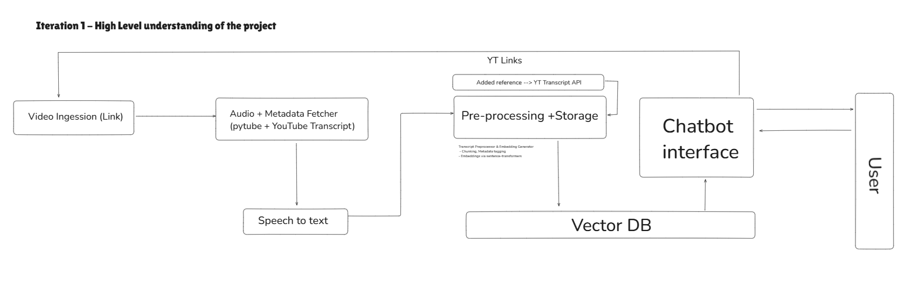
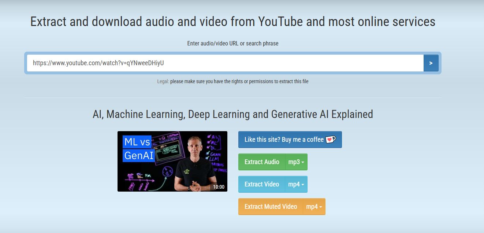
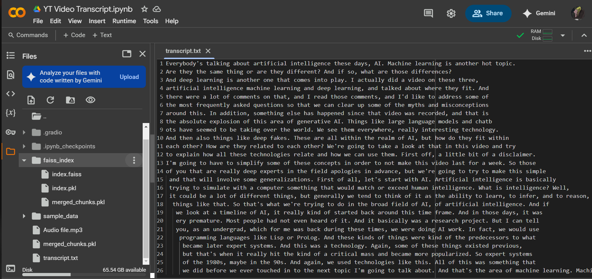
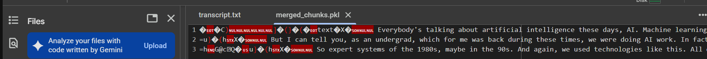
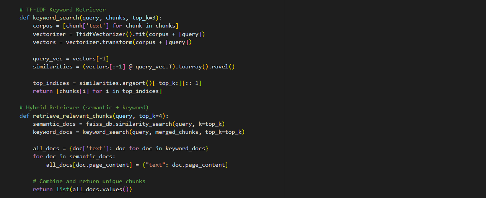
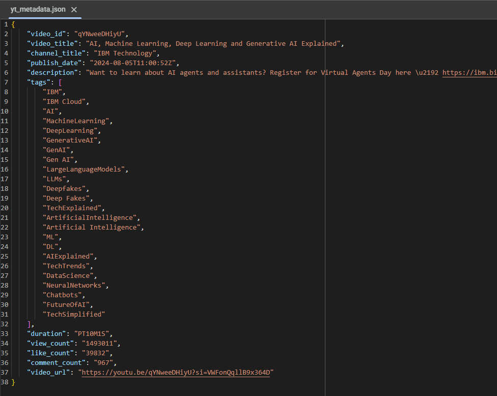
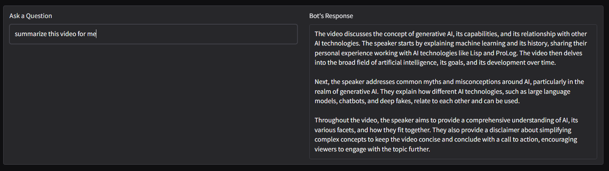

# AI Agent for YouTube Video Transcript

## Overview

This project is part of a technical evaluation assignment focused on building an AI-powered agent that autonomously processes YouTube video content to generate transcripts and enable interactive NLP-based querying. The system demonstrates integration of speech recognition, YouTube video handling, and natural language processing (NLP) techniques, showcasing a complete AI automation pipeline.

This agent is intended to help customer support, research, content review, or educational teams automatically convert YouTube videos into searchable, structured, and interactive text-based insights.

Points of Implementation
- Context aware Chunking and TIme-stamped Transcription
- Text Optimization & FAISS Index Creation
- Importing Available Metadata and adding into knowledge base
- RAG Based Retrival system --> Sematic + Keyword + Lanchain Doc search
- Dual Memory Supprot (Short term {Chat History 3} + Long Tern {Knowledge Base})
- Error Free Hosting
- Loom Video Link - []

**Flowchart Overview of the Pipeline:**



---

## Objective

The goal of the project is to build an AI Agent that can:

- Download audio from YouTube videos (Manual atp --> YT sided error).
- Transcribe speech into text using OpenAI Whisper.
- Provide search functionality over the transcript.
- Enable timestamped keyword extraction.
- Optionally, perform summarization using transformer-based models.

---

## Tools and Technologies Used

| Component               | Tool/Library                         |
|-------------------------|--------------------------------------|
| Video Downloading       | pytube                               |
| Speech-to-Text          | OpenAI Whisper                       |
| Transcript Handling     | pandas, re                           |
| Optional NLP Features   | HuggingFace Transformers, spaCy      |
| User Interface (optional)| Streamlit or Flask                  |
| Visualization           | matplotlib, plotly (for demo use)    |

---

## Features

- Audio extraction from YouTube
- Accurate transcription using Whisper
- Transcript saved as structured CSV
- Search functionality: keyword or phrase lookup
- Timestamp extraction for searched phrases
- (Optional) Transcript summarization using NLP

---

## Project Structure

```
YT_Video_Transcript/
├── YT_Video_Transcript.ipynb       # Main notebook with implementation
├── transcripts/
│   └── [video_id]_transcript.csv   # Auto-saved transcripts
├── README.md                       # This documentation
├── assets/                         # Screenshots, flowcharts, diagrams
│   ├── youtube_download.png
│   ├── transcript_output.png
│   ├── search_feature.png
│   ├── keyword_timestamps.png
│   ├── summarization.png
│   ├── dataflow_diagram.png
│   └── component_flowchart.png
```

---

## Approach and Milestones

### Step 1: Fetch YouTube Video and Audio

- Used pytube to download only the audio stream. --> Currently using Direct audio source 
- Ensured compatibility with Whisper input requirements.

**Image Placeholder:**



---

### Step 2: Transcription with Whisper

- Whisper base model used for transcription.
- Outputs text with associated start/end timestamps.

**Image Placeholder:**

`

---

### Step 3: Context-aware + timestamped Transcript extraction

- Dynamically merge faster-whisper chunks into contextual blocks (300–500 tokens) While merging, track the start of the first and end of the last segment
- Each chunk contains timestamp and corresponding text.

**Image Placeholder:**



---

### Step 4: Search Functionality - Text Optimization & FAISS Index Creation

- Used Semantic + Keyword + LangChain Document search for best paced search. 
- Retrieved most relevant chunks (Combination of all 3, no recurring)

**Image Placeholder:**



---

### Step 5: Importing Available Metadata

- Importing Video metadata (Desc, Links, Captions)
- Added to knowledge base for precise mapping and overall context understanding.

**Image Placeholder:**



---

### Step 6: Summarization and hosting

- Integrated HuggingFace summarizer (`bart-large-cnn`).
- Condensed transcript into readable summary.
- Hosted using Gradio.

**Image Placeholder:**



---

## How to Run

### Requirements

```bash
pip install pytube
pip install git+https://github.com/openai/whisper.git
pip install pandas
pip install torch
```

Optional (for NLP and UI):

```bash
pip install transformers
pip install spacy
pip install streamlit  # only for UI
```

---

### Usage

1. Clone this repo or upload to Colab/Kaggle.
2. Open and run the notebook `YT_Video_Transcript.ipynb`.
3. Paste your YouTube video URL in the designated cell.
4. Execute all cells to:
   - Download the audio
   - Transcribe it
   - Search transcripts
   - Extract timestamps
   - Optionally summarize

---

## Sample Transcript Format

| Start Time   | End Time     | Text                                     |
|--------------|--------------|------------------------------------------|
| 00:00:01.02  | 00:00:04.50  | Hello everyone and welcome to the video. |
| 00:00:04.51  | 00:00:09.10  | Today we’ll explore machine learning...  |

---

## Diagrams and Flowcharts

### Data Flow Diagram

``

### Component Flowchart

``

---

## Testing Strategy

- Ran across multiple video types: tutorials, podcasts, tech reviews.
- Manually verified alignment of transcribed timestamps.
- Ensured keyword searches return correct matches and time points.
- Optional: Benchmarked summarization accuracy against manual summaries.

---

## Assumptions

- Videos are in English (default for Whisper base).
- Audio is not noisy or overly distorted.
- YouTube URL is public and accessible.

---

## Future Enhancements

- UI via Streamlit or Flask
- Multi-language transcription, Video summary --> PDF
- Auto-NER (Named Entity Recognition)
- Export transcripts as PDF/HTML
- Integration with video chapters and highlights

---

## Evaluation Criteria Mapping

| Evaluation Criteria   | Implementation Summary                                 |
|-----------------------|--------------------------------------------------------|
| Functionality         | Full transcription, search, and timestamp support      |
| Creativity            | Added summarization and detailed logs                  |
| Code Quality          | Modular, readable, and well-commented notebook         |
| Documentation         | Full README with usage, diagrams, and outputs          |
| Demo                  | Screenshots and complete walkthrough in notebook       |

---

## Timeline Breakdown

| Day  | Milestone                                   |
|------|---------------------------------------------|
| Day 1| Implement video download and transcription  |
| Day 1| Save to CSV and implement search/timestamps |
| Day 2| NLP summarization, testing, visual outputs  |
| Day 2| README documentation and deliverable prep   |

---

## Author

- Name: Harsh Chinchakar
- Email: harshchinchakar33@gmail.com
- LinkedIn: [https://www.linkedin.com/in/harshchinchakar/](https://www.linkedin.com/in/harshchinchakar/)

---

## License

This project is released under the MIT License.
